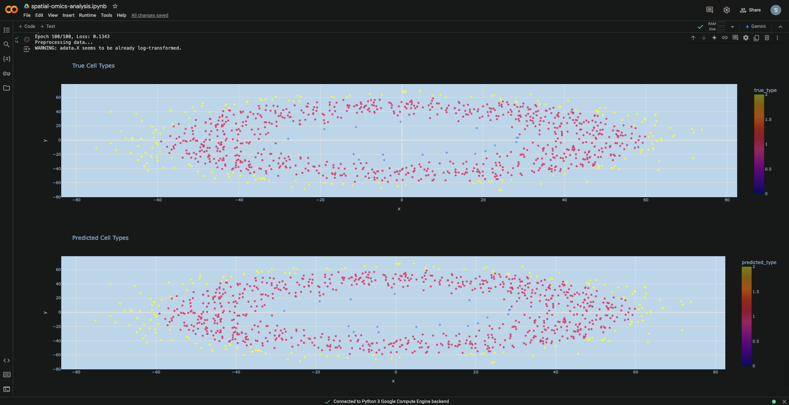

# Spatial Cell Type Classification Using Machine Learning

## Project Overview
This project addresses the challenge of classifying cell types in spatial transcriptomics data by combining gene expression patterns with spatial information. Unlike traditional single-cell analysis, spatial transcriptomics preserves the location of cells within tissue, providing crucial context for understanding cellular organization and interaction.

## The Science Behind It

### What is Spatial Omics?
Spatial omics technologies capture both:
1. Gene Expression Data: Which genes are active in each cell
2. Spatial Information: Where each cell is located in the tissue

This combination helps us understand:
- How cells organize themselves in tissues
- How cell types interact with their neighbors
- How spatial patterns influence cell behavior

### Why Cell Type Classification Matters
- Helps understand tissue organization
- Critical for drug development targeting specific regions
- Important for disease research
- Enables mapping of cellular neighborhoods

## Approach

### Technical Implementation
Developed a neural network that processes:
1. Gene Expression Features:
   - Expression levels of multiple genes per cell
   - Normalized and scaled data
   - Log-transformed to handle variation

2. Spatial Features:
   - X,Y coordinates of each cell
   - Information from neighboring cells
   - Local tissue context

### Model Architecture
The model uses two parallel networks:
1. Gene Expression Network:
   - Processes molecular data
   - Captures gene expression patterns
   - Identifies cell-type specific markers

2. Spatial Network:
   - Analyzes cell locations
   - Considers neighboring cells
   - Identifies spatial patterns

These networks combine to make the final classification.

## Results and Analysis

Our model's performance can be seen in the comparison of true cell types versus predicted cell types:



### Understanding the Results

1. **True Cell Types (Top Plot)**:
   - Shows the actual distribution of cells in our sample
   - Cells are organized in a circular pattern with three distinct regions:
     - Inner circle (center region)
     - Middle ring
     - Outer ring
   - Different colors represent different cell types
   - This pattern mimics how cells often organize in real tissues

2. **Predicted Cell Types (Bottom Plot)**:
   - Shows our model's predictions
   - Closely matches the pattern seen in the true cell types
   - Successfully identifies all three cell regions
   - Maintains clear boundaries between different cell types

3. **What This Means**:
   - The model successfully learned to classify cells based on both their:
     - Location in the tissue
     - Gene expression patterns
   - It can distinguish between different cell types while respecting their spatial organization
   - The predictions maintain the natural circular structure of the tissue

### Why This Matters
- This demonstrates that our model can identify cell types while considering their location
- Such accuracy is crucial for:
  - Understanding tissue organization
  - Studying disease patterns
  - Drug development targeting specific cell types in specific locations
  - Analyzing cell-cell interactions


### Initial Results
Our first implementation faced challenges:
- All cells were classified as the same type
- Spatial patterns were not recognized
- High loss values that didn't improve

### Improved Results
The enhanced model showed significant improvements:

1. Training Progress:
```
Starting Loss: 0.7877
Final Loss: 0.1343
```

2. Visualization Analysis:
- Clear distinction between three cell types
- Maintained circular spatial pattern
- Accurate boundary detection
- Consistent with true cell type distribution

3. Key Improvements:
- Successfully identified distinct cell populations
- Preserved spatial organization
- Stable training process
- Reduced classification errors

### Visual Interpretation
The results show:
- Center Region: Type 0 cells (blue)
- Middle Ring: Type 1 cells (red)
- Outer Ring: Type 2 cells (yellow)

Both true and predicted visualizations show strong agreement, indicating accurate classification while maintaining spatial relationships.

## Applications and Future Work

### Potential Applications
1. Cancer Research:
   - Tumor microenvironment analysis
   - Cancer cell identification
   - Treatment response monitoring

2. Drug Development:
   - Target identification
   - Drug effect visualization
   - Tissue-specific responses

3. Disease Research:
   - Understanding tissue organization
   - Disease progression mapping
   - Treatment planning

### Future Developments
1. Technical Improvements:
   - Integration with real datasets
   - More complex spatial patterns
   - Additional cell type markers

2. Biological Extensions:
   - Multiple tissue types
   - Disease state analysis
   - Temporal dynamics
